# 🧙 Exercise 1: Connect to Your Magical LLM

Welcome to your first spell in the Testus Patronus journey! In this exercise, you'll connect your Dify instance to a powerful Azure-hosted Large Language Model (LLM), which will become the core of your AI assistant.

> **This is the foundation of your Retrieval-Augmented Generation (RAG) assistant. Without a working LLM, the magic won't flow.**

---

## 🛠️ Step 1: Launch Your Dify Instance

Click the magic URL to get your resources:

👉 [Launch your Dify instance](https://tgilw5l4loeq2dkrtbsta27csm0entsv.lambda-url.eu-west-3.on.aws/)

You'll be redirected to a personalized page like this:

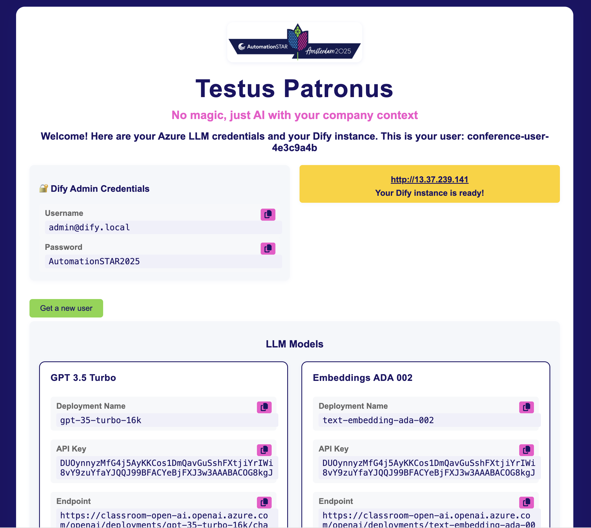

This page provides:
- Your **Dify instance URL**
- Azure **LLM credentials** (for both GPT-3.5 and Embeddings)
- A warning that the instance is ephemeral (so save anything critical before the end of the session)

> 🧠 **Tip:** Leave this tab open during the session so you can copy/paste credentials as needed.

---

## 🛡️ Step 2: Dify Admin Account Setup

Before you can use Dify, you'll need to set up an admin account. On your first visit to your Dify instance, you'll see a screen like this:

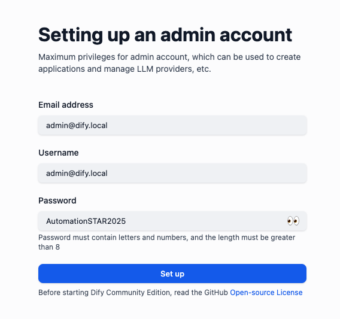

- **Email address:** You do NOT need to use a real email address, but you must remember what you enter here.
- **Username & Password:** Choose any username and password, but make sure to remember them—you'll need them to log in again.

> ⚠️ **Important:** If you forget your email or password, you may not be able to access your admin account for this session.

---

## 🧪 Step 3: Log in to Dify

1. Login to Dify with the previous created user email and password

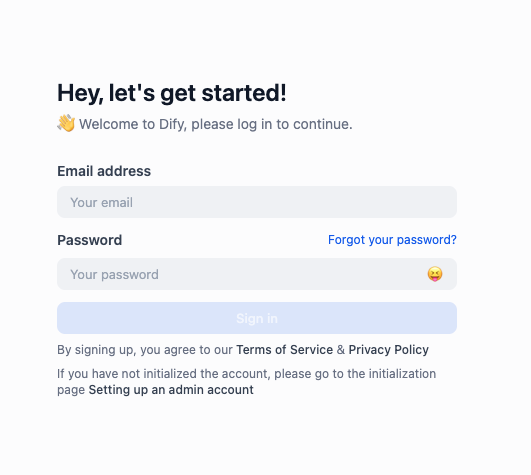

2. You will land in the Dify Landing page

### 🗂️ Exploring Dify's Sections

Dify is divided into several key sections to help you manage your AI assistant:

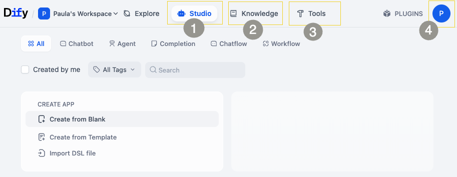 

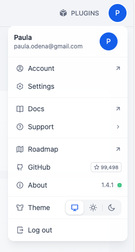

#### 🎨 1. Studio

The Studio is the main grid where you'll find and manage the chatbots you create. This is where you'll design and customize your chatbot's conversations and interactions.

#### 📚 2. Knowledge

The Knowledge section is where you'll import and manage your knowledge base documents. This is where you'll upload and organize the information that your chatbot will use to answer questions and provide information.

#### 🔧 3. Tools

The Tools section provides access to various plugins and configurations that can be used to customize and extend your chatbot's capabilities. This is where you'll find settings for integrating with other services, managing user roles, and more.

#### 4. Settings

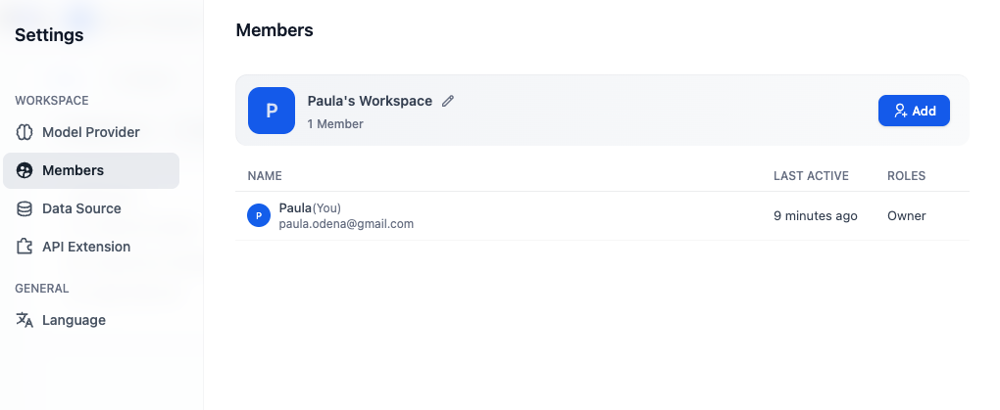

---

## 🔗 Step 4: Configure the Azure GPT LLM

Follow next steps to configure the LLMs in Dify:

### 1. Install Model Provider 
We will install Azure OpenAI Service Model
 - Go to Settings and select Model Provider section
 - Find Azure OpenAI Service Model and Install it

### 2. Add an LLM model
Once the provider has been installed we can add a model, by clicking the option "Add Model"

Use the information from your credential screen to configure GPT 3.5 Turbo:

| Field | Value (from credential screen) |
|-------|--------------------------------|
| **Provider** | Azure OpenAI |
| **Model Name** | `gpt-35-turbo-16k` |
| **Endpoint** | (paste the full endpoint URL) |
| **API Key** | (copy the key) |
| **API Version** | `2024-12-01-preview` |

### 3. Add an Embedding model

Repeat the same for the **Embedding Model**:
| Field | Value |
|-------|-------|
| **Model Name** | `text-embedding-ada-002` |
| **API Version** | `2023-05-15` |

---

## ✅ Step 5: Setup a classical Chatboot

### 1. Create From Blank
- Navigate to  **Studio**, select **Chatbot** and in the Create App card select **Create from Blank**:

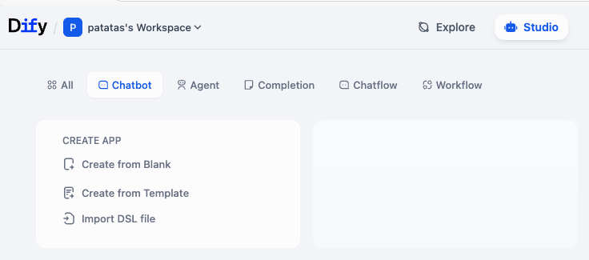

- Select **Workflow** and give your Chatbot a name and a Description:

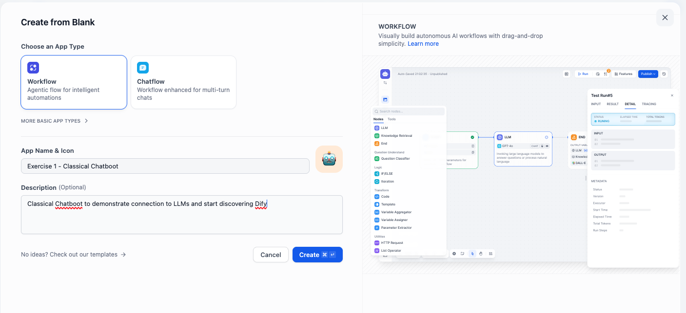

- Click On the **start** of your workflow. We need to configure a starting parameter to hold the user's queries. 

Click on the **+** button to create a new **Input Field** called **query** make sure to assign the new input a lenght that suites the kind of queries you prettend to do. For example set it to "Max length" 200

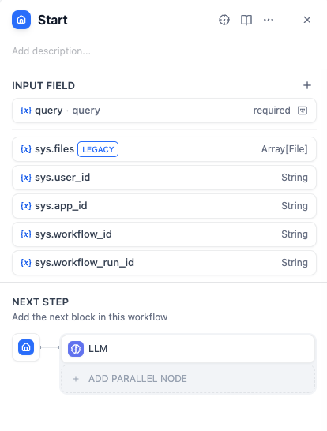

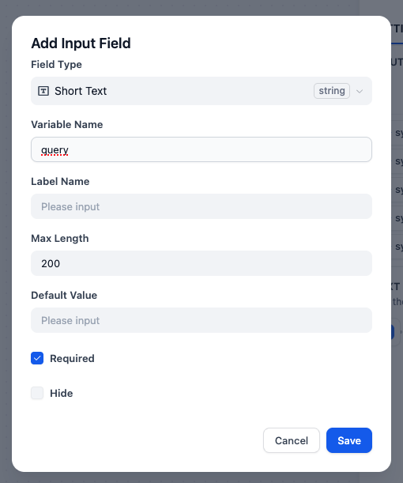

- Now you can click on the **+** button on the start block and see all the available Dify Blocks to build your chatbot. 

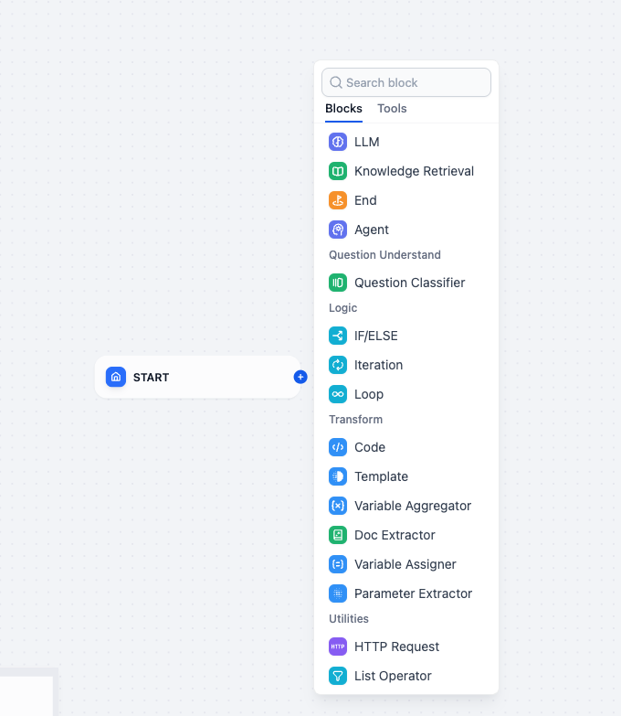

- Select the LLM one.
Make sure you reference your GPT 3.5 model and also create a Prompt on the **System** section, for example:

> _"Answer in a clean professional tone. Be concise but as precise as possible"_

And add query and Context to the prompt by clicking on the "\{x\}"

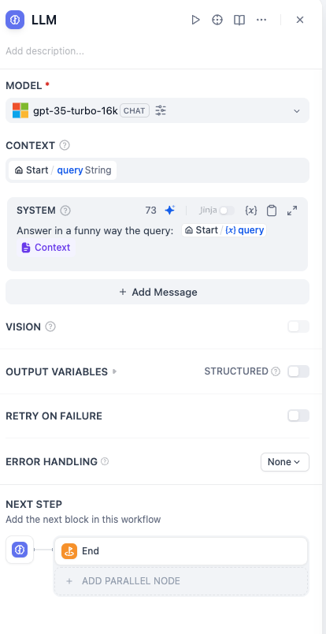

- Add a final **End** block and add an output variable called **text** this comes from the output variables from the LLM block, and has the answer to the user's query. 
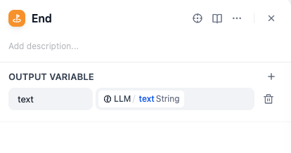

### 2. Let's test our first Chatbot! 

-  On the top right section click on **Run**. In the input section add a query and **Start Run**:

> _"What is the difference between unit and integration testing?"_

If you get a response: 🎉 You're connected and ready for the next spell!

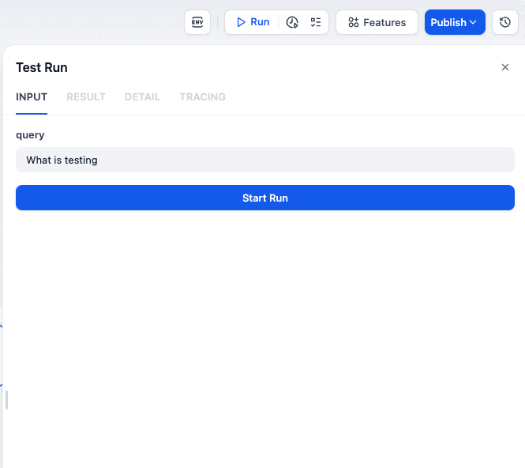

- It is interesting also to take a look at the **Tracing** window, it is specially useful for debugging! 

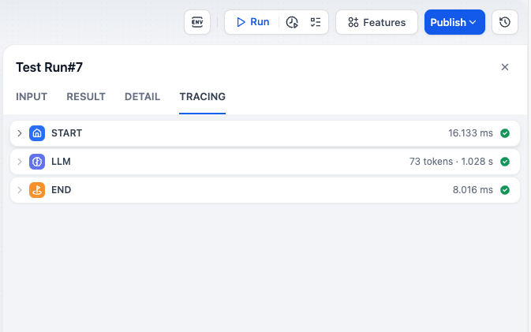

---

## 🧙 Exercise 1 Solution

Click the button below to download the Dify DSL configuration for this exercise:

<a
  href="/dify-dsls/blackboard.yml"
  download
  style={{
    display: 'inline-flex',
    alignItems: 'center',
    justifyContent: 'center',
    padding: '0.5em 1.2em',
    color: '#fffce7',
    background: '#7c3aed',
    border: 'none',
    borderRadius: '6px',
    fontWeight: 600,
    textDecoration: 'none',
    marginTop: '1em',
  }}
>
  ⬇️ Download blackboard.yml
</a>
