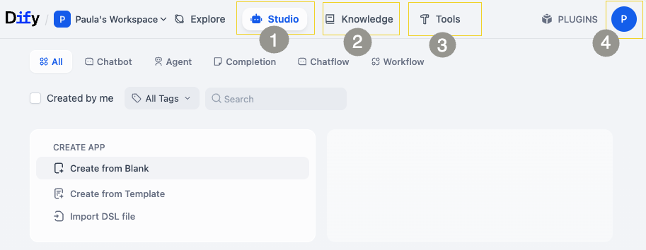
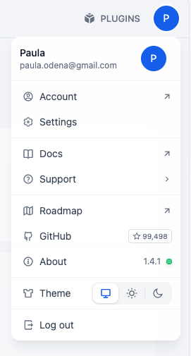
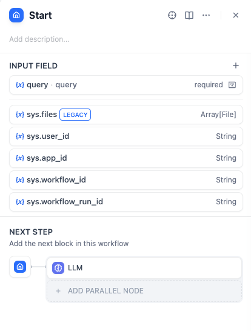
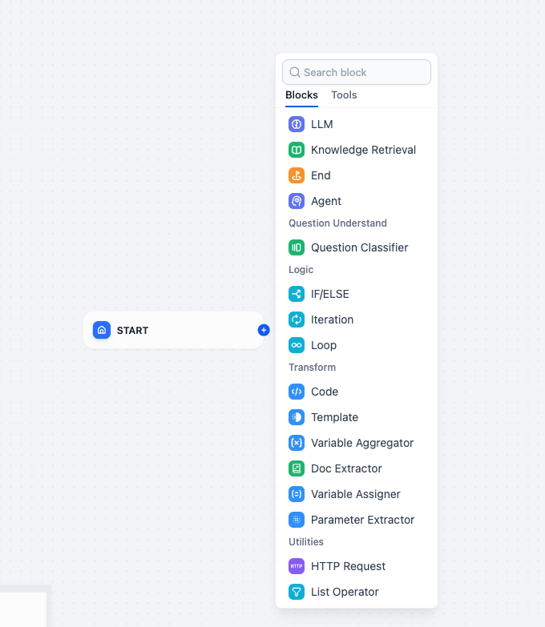
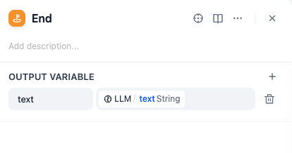

# 🧙 Exercise 1: Connect to Your Magical LLM

Welcome to your first spell in the **Testus Patronus** journey!  
In this exercise, you’ll connect your Dify instance to a powerful Azure-hosted Large Language Model (LLM), which will become the *core* of your AI assistant.

> ✨ **This is the foundation of your Retrieval-Augmented Generation (RAG) assistant. Without a working LLM, the magic won’t flow.**

---

## 🧭 What You’ll Do in This Exercise

<ul style={{ listStyle: 'none', padding: 0, marginBottom: '1em' }}>
  <li><label><input type="checkbox" /> <strong>Launch</strong> your personal Dify instance</label></li>
  <li><label><input type="checkbox" /> <strong>Configure</strong> a connection to Azure-hosted LLMs (GPT-3.5 Turbo & Embeddings)</label></li>
  <li><label><input type="checkbox" /> <strong>Set up</strong> your admin account</label></li>
  <li><label><input type="checkbox" /> <strong>Explore</strong> Dify’s main sections</label></li>
  <li><label><input type="checkbox" /> <strong>Create</strong> your first chatbot using Dify's visual workflow editor</label></li>
</ul>

---

## 🛠️ Step 1: Launch Your Dify Instance

Click the magic URL to summon your resources:

👉 [**Launch your Dify instance**](https://tgilw5l4loeq2dkrtbsta27csm0entsv.lambda-url.eu-west-3.on.aws/)

You’ll be redirected to a personalized portal like this:

This page includes:
- Your **Dify instance URL**
- Azure **LLM credentials** (for both GPT-3.5 and Embeddings)
- A reminder that the instance is **ephemeral** — *save your work before the session ends!*

> 🧠 **Tip:** Keep this tab open during the session for easy copy/paste access.

---

## 🛡️ Step 2: Dify Admin Account Setup

On your first visit, you’ll need to create an admin account:

- You can enter *any email address* (it doesn’t need to be real), but you *must remember* it.
- Choose a username and password you’ll recall easily.

> ⚠️ **Important:** If you forget your email or password, you may lose access to the session.

---

## 🧪 Step 3: Log in to Dify

1. Log in using the credentials you just created:

2. You’ll land on the Dify dashboard.

### 🗂️ Explore Dify's Main Sections

 

#### 🎨 Studio
Design and manage your chatbots here using visual blocks and workflows.

#### 📚 Knowledge
Upload documents your assistant can reference—perfect for product specs, requirements, and test cases.

#### 🔧 Tools
Access extra plugins, service integrations, and advanced settings.

#### ⚙️ Settings
Manage model providers, keys, and other configuration options.

---

## 🔗 Step 4: Configure the Azure GPT LLM

Now let’s wire your Dify to use Azure-hosted GPT models.

### 1. Install Model Provider

- Navigate to **Settings → Model Provider**
- Install **Azure OpenAI Service**

### 2. Add a GPT-3.5 LLM

Use the credentials provided earlier to configure the model:

| Field | Value |
|-------|-------|
| **Provider** | Azure OpenAI |
| **Model Name** | `gpt-35-turbo-16k` |
| **Endpoint** | *(paste endpoint URL)* |
| **API Key** | *(paste your key)* |
| **API Version** | `2024-12-01-preview` |

### 3. Add Embedding Model

| Field | Value |
|-------|-------|
| **Model Name** | `text-embedding-ada-002` |
| **API Version** | `2023-05-15` |

> ✅ You’re now LLM-connected and ready to build.

---

## 🤖 Step 5: Create Your First Chatbot

### 1. Create From Blank

Go to **Studio → Chatbot → Create from Blank**:

- Select **Workflow**
- Give your bot a name and description

### 2. Setup Query Input

- Click on **start** block
- Click **+** to create an *Input Field* named `query`
- Set a suitable max length, e.g., `200`

### 3. Add LLM Block

- Click **+** and select the **LLM** block

- Reference your model
- Add a System prompt like:

> _“Answer in a clean, professional tone. Be concise but precise.”_

- Bind the prompt to `query` and `context` using `{x}` selector

### 4. Add End Block

- Add an **End** block
- Create an output variable (e.g., `text`) linked to the LLM response

---

### 🧪 Run and Debug

Click **Run**, input a question, and hit **Start Run**:

> _“What is the difference between unit and integration testing?”_

🎉 You should get a response from your magical assistant!

Check the **Tracing** tab for a breakdown of what your chatbot did:

---

## 🧙 Exercise 1 Solution Download

Want a reference configuration?

<a
  href="/dify-dsls/blackboard.yml"
  download
  style={{
    display: 'inline-flex',
    alignItems: 'center',
    justifyContent: 'center',
    padding: '0.6em 1.2em',
    color: '#fffce7',
    background: '#7c3aed',
    borderRadius: '6px',
    fontWeight: 600,
    textDecoration: 'none',
    marginTop: '1em',
  }}
>
  ⬇️ Download blackboard.yml
</a>
